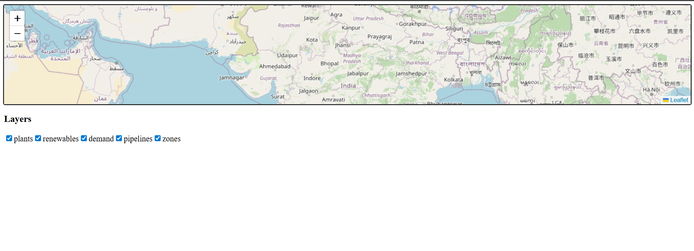

# 🌱 Green Hydrogen Infrastructure Mapping & Optimization

A full-stack MERN application to visualize and optimize **green hydrogen infrastructure** using an interactive map.  
Built with **React + Vite, TailwindCSS, React-Leaflet** on the frontend and **Node.js + Express + MongoDB** on the backend.

---



## 🚀 Tech Stack
- **Frontend:** React (Vite), TailwindCSS, Zustand (state), React-Leaflet (map), Axios  
- **Backend:** Node.js, Express.js, MongoDB (Mongoose ORM)  
- **Map Tiles:** OpenStreetMap (default) / MapTiler (for faster tiles)  

---

## 📦 Installation

### 1. Clone repository
```bash
git clone https://github.com/your-username/green-h2-map.git
cd green-h2-map
```

### 2. Install dependencies
#### Frontend
```bash
cd client
npm install
```

#### Backend
```bash
cd server
npm install
```

---

## ⚙️ Configuration

### Frontend
Create a `.env` file inside `client/`:

```
VITE_API_URL=http://localhost:4000
VITE_MAPTILER_KEY=YOUR_MAPTILER_KEY   # optional, for faster map tiles
```

### Backend
Create a `.env` file inside `server/`:

```
PORT=4000
MONGO_URI=mongodb://127.0.0.1:27017/greenhydrogen
```

---

## ▶️ Running the app

### Start backend
```bash
cd server
npm run dev
```

### Start frontend
```bash
cd client
npm run dev
```

Frontend runs on `http://localhost:5173`  
Backend runs on `http://localhost:4000`

---

## 🌍 Features
- Interactive **map viewer** (React-Leaflet)
- Toggle **layers** (Plants, Renewables, Pipelines, Demand, Zones)
- **Click or Draw AOI** → fetch site suggestions from backend
- Optimized **site scoring** with breakdown charts
- TailwindCSS styled UI (modern, responsive)

---

## 📸 Screenshots
*(Add screenshots of your map UI here)*

---

## 🛠️ Development Notes
- Ensure MongoDB is running locally (`mongod`) or via Docker:
  ```bash
  docker run -d -p 27017:27017 mongo
  ```
- If OSM map tiles load slowly, use MapTiler with an API key.

---

## 📜 License
MIT License © 2025
